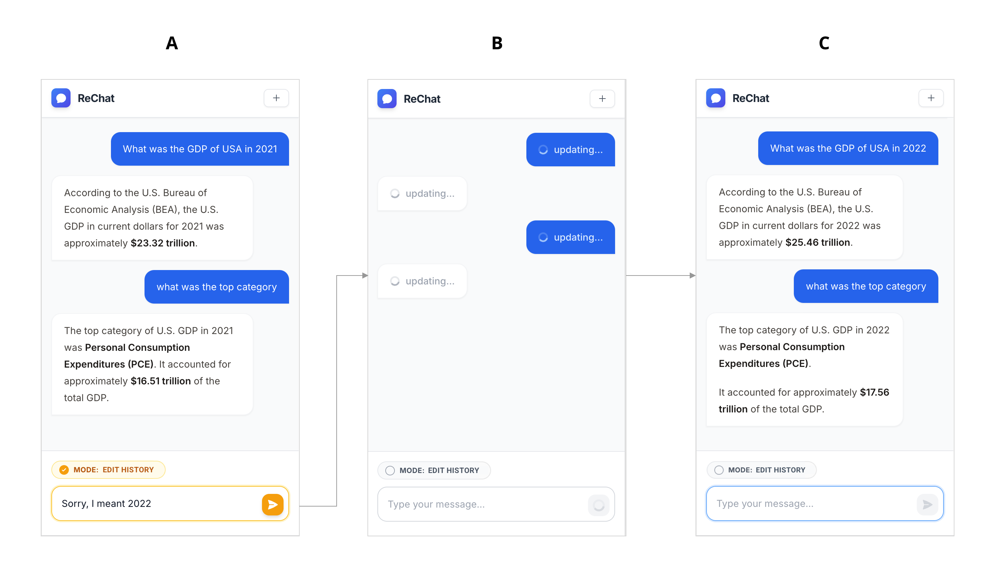

# ReChat

ReChat is a configurable chat interface to conduct research into Mutable Transcripts. Mutable Transcripts is an interaction paradigm that enables users to revise prior conversational turns through natural language edit requests, allowing the conversation history itself to be updated rather than appended. This reframes the transcript from a passive record into an editable representation of conversational state. We present a working prototype that integrates transcript-level revision into a standard chat interface. 

<p align="center">
  
</p>
Interface design: (A) At any point in the conversation, the user can engage “Edit History”
mode and enter a prompt to modify the chat history. (B) The UI refreshes and shows that previous
conversational turns are updating. (C) The UI refreshes with the updated conversation constraint.

## Paper

Paper PDF: [ToDO: Add public paper link]

Cite as: [ToDO: Add citation]

BibTeX:

```bibtex
% ToDO: Add BibTeX entry
```

This repository is a public version of the Mutable Transcripts prototype accompanying the paper. It preserves the paper defaults, including the default prompts and interaction structure, while exposing additional configuration options for public use, such as user-supplied Gemini API keys, model selection, and editable prompts.

This repo should therefore be understood as a public-facing research artifact rather than a locked reproduction of the exact study environment. The default configuration matches the paper, but users can modify settings through the interface.

Any changes to the model or prompts may cause behavior to diverge from the results and examples described in the paper.


## What This Repo Implements

- Standard multi-turn chat with Gemini
- A rewrite mode that edits prior conversational history instead of appending a new turn
- Configurable prompts and model selection for exploring Mutable Transcripts behavior
- A browser-only deployment model suitable for self-hosting with user-supplied API keys

## Defaults Matching The Paper

- Default model: `gemini-2.5-flash`
- Default system prompt: `You are a helpful and concise AI assistant.`
- Default rewrite flow: the app uses a fixed rewrite wrapper plus the default rewrite prompt shipped in the UI
- Default interaction structure: users can either chat normally or issue natural-language rewrite requests that modify the transcript history

These defaults are the initial configuration presented by the public app.

## What You Can Change

- Gemini API key
- Model selection
- System prompt
- Rewrite prompt

## Privacy And Storage

- Gemini API keys are user-supplied and stored in browser `localStorage`
- Prompt settings and model selection are also stored in browser `localStorage`
- Chat requests are made directly from the browser to the Gemini API using the user's key
- This repo does not include backend-side storage or a server-side Gemini proxy

## Run Locally

Prerequisite: Node.js

1. Install dependencies:
   `npm install`
2. Run the app:
   `npm run dev`
3. Open the app in your browser and enter your personal Gemini API key when prompted.

## Deploy To Netlify

1. Connect the repository to Netlify.
2. Use `npm run build` as the build command.
3. Use `dist` as the publish directory.
4. Do not configure a server-side Gemini key in Netlify env vars for this app.
